# synDx Clinical Model Evaluation Report
## Validation of Neurological Symptom Phenotype Classification in Wilson Disease Patients

**Project**: synDx Clinical ML Research Pipeline  
**Document Type**: Stage 02–04 Cross-Model Validation Report  
**Date**: September 2026  
**Status**: Validation Phase (Preliminary Research Only)  
**Final Test Set Status**: **SEALED — NOT EVALUATED**  

---

> [!IMPORTANT]
> **CRITICAL CLINICAL & REGULATORY DISCLAIMER**  
> This research investigates machine-learning classification of a *neurological-symptom phenotype* among individuals already diagnosed with Wilson disease ($n=185$).  
> **The models evaluated in this report are NOT diagnostic models for Wilson disease.** They do not differentiate Wilson disease patients from healthy individuals or from patients with other hepatic or neurological disorders. The reported validation performance must not be construed as validated diagnostic efficacy, clinical utility, or readiness for clinical decision support or regulatory clearance.

---

# 1. Executive Summary

This formal technical evaluation report documents the empirical validation of three independent baseline machine-learning classifiers—**XGBoost**, **LightGBM**, and **Random Forest**—developed within the synDx clinical machine-learning pipeline. The primary research task is the binary classification of neurological symptom phenotypes within a single-center cohort of 185 patients diagnosed with Wilson disease.

All models were evaluated under identical, strictly controlled experimental conditions using an isolated validation split ($n=37$, representing 20% of the cohort). The final test partition ($n=37$, 20%) was sealed prior to model training and remained completely untouched to prevent data leakage and avoid optimistic bias during model comparison.

### Key Validation Findings
- **Discriminative Capability (Ranking)**: Gradient-boosted decision trees exhibited stronger ranking discrimination than the bagging ensemble. **XGBoost** achieved the highest validation discrimination with a Receiver Operating Characteristic Area Under the Curve (**ROC-AUC**) of **0.7875** and Precision-Recall Area Under the Curve (**PR-AUC**) of **0.9621**, followed by **LightGBM** (ROC-AUC **0.7500**, PR-AUC **0.9501**) and **Random Forest** (ROC-AUC **0.7000**, PR-AUC **0.9364**).
- **Nominal Accuracy vs. Minority Phenotype Sensitivity**: At the standard uncalibrated classification threshold of $0.5$, both XGBoost and LightGBM attained a nominal validation accuracy of **0.9189** (34/37 correct) and a balanced accuracy of **0.7000**. Random Forest attained an accuracy of **0.8649** and a balanced accuracy of **0.5000**.
- **Class Imbalance & Specificity Disparity**: Due to severe class imbalance (88.1% positive phenotype prevalence in the total cohort; 86.5% in validation), high accuracy is largely driven by ubiquitous detection of the majority class (sensitivity = **1.0000** across all three models). In contrast, detection of the minority phenotype (Class 0, $n=5$ in validation) revealed notable weakness: XGBoost and LightGBM correctly identified only 2 of 5 minority cases (specificity = **0.4000**), while unweighted Random Forest assigned all 37 patients to Class 1 (specificity = **0.0000**).
- **Preliminary Nature**: These findings are strictly exploratory and preliminary. Given the modest cohort size ($n=185$), the constrained validation sample ($n=37$), and the low absolute count of minority instances ($n=5$), observed metrics carry wide confidence intervals. These results represent initial comparative baseline characteristics to guide future ensemble construction and threshold optimization rather than production-grade diagnostic performance.

---

# 2. Research Objective

Wilson disease (hepatolenticular degeneration) is an autosomal recessive copper-metabolism disorder presenting with pronounced phenotypic heterogeneity, commonly manifesting as hepatic disease, neurological impairment, psychiatric symptoms, or mixed presentations. The objective of this research initiative is to evaluate standard supervised machine-learning architectures for predicting the presence or absence of a specific **neurological-symptom phenotype** among confirmed Wilson disease patients using routine clinical laboratory indices, cranial neuroimaging findings, and abdominal ultrasound observations.

> [!WARNING]
> **Explicit Boundary of Investigation**  
> **The models are not being evaluated for diagnosis of Wilson disease itself.** All patients included in the study cohort have established Wilson disease. The classification target (`label`) reflects intracohort phenotypic subtyping. Consequently, this pipeline should be designated as a *clinical phenotype research classifier*, not a disease detection or screening tool.

---

# 3. Dataset Description

The clinical cohort comprises records from 185 unique patients with clinically and biochemically confirmed Wilson disease.

### Cohort Breakdown
- **Total Patients**: 185
- **Input Features**: 42 clinical, imaging, and biochemical predictors
- **Target Variable**: `label` (binary indicator of neurological-symptom phenotype: 0 = absence, 1 = presence)
- **Class Imbalance**:
  - **Class 0 (Absence of Neurological Phenotype)**: 22 patients (11.89%)
  - **Class 1 (Presence of Neurological Phenotype)**: 163 patients (88.11%)
  - **Overall Imbalance Ratio (Negative:Positive)**: $1 : 7.41$ ($n_{\text{neg}}/n_{\text{pos}} \approx 0.1350$)

### Feature Space & Preprocessing Fidelity
The 42 predictive features encompass:
1. **Neuroimaging Manifestations (Binary Yes/No)**: Lenticular nucleus damage, thalamic lesions, brainstem damage, cerebral ventricular dilation, sulcal/fissural deepening, cerebral peduncle damage, cerebral cortex lesions, other regional brain involvement.
2. **Abdominal Ultrasound Findings (Binary Yes/No)**: Cirrhosis, ascites, liver capsule smoothing, enhanced internal liver echo, homogeneous liver echogenicity, vascular clarity.
3. **Hematological & Coagulation Markers**: WBC, RBC, Hemoglobin (Hb), Platelet count (PLT), Prothrombin Time (PT), International Normalized Ratio (INR), Activated Partial Thromboplastin Time (APTT), Fibrinogen (FBG), Thrombin Time (TT).
4. **Hepatic & Renal Biochemistry**: Alanine aminotransferase (ALT), Aspartate aminotransferase (AST), Total Bile Acids (TBA), Total Bilirubin (TBIL), Direct Bilirubin (DBIL), Indirect Bilirubin (IBIL), Total Protein (TP), Albumin (ALB), Gamma-glutamyl Transferase (GGT), Alkaline Phosphatase (AKP), Blood Urea Nitrogen (BUN), Serum Creatinine (Cr).
5. **Copper Metabolism & Clinical Scores**: 24-hour urinary copper excretion, Serum ceruloplasmin (CP), Psychiatric symptom score, Liver symptom score, Age, Gender, Kayser-Fleischer (K-F) ring presence.

### Data Hygiene & Integrity
- **Missing Values**: 0 missing entries across the entire matrix ($185 \times 43$).
- **Duplicates**: 0 exact duplicate records.
- **Synthetic Data Generation**: Strictly **no** SMOTE, ADASYN, random oversampling, or synthetic record fabrication was conducted.
- **Feature Representations**: All features were preserved in their authentic numerical representation following trimming of whitespace from column names during Stage 01 preprocessing.

---

# 4. Data Splitting and Leakage Prevention

To ensure unbiased evaluation and prevent data leakage, the 185-patient cohort was partitioned into three distinct subsets using stratified sampling based on the binary target (`label`), locked with random seed `42`:

```text
Full Patient Cohort (N = 185)
├── Training Set   : 60% (n = 111 patients | Class 0 = 13, Class 1 = 98)
├── Validation Set : 20% (n =  37 patients | Class 0 =  5, Class 1 = 32)
└── Final Test Set : 20% (n =  37 patients | Class 0 =  4, Class 1 = 33) [SEALED]
```

### Protocol for Leakage Prevention
1. **Isolated Validation**: The validation set ($n=37$) served as the sole data source for baseline model comparison, hyperparameter verification, and threshold performance monitoring.
2. **Sealed Final Test Set**: The test set ($n=37$) was generated during Stage 01 and immediately locked. In accordance with strict machine learning governance, the test set was neither loaded nor evaluated by any model development script (`RUN_FINAL_TEST = False`).
3. **Zero Information Leakage**: No normalization statistics, imputation rules, or feature selection routines utilized validation or test set information.

---

# 5. Model Configuration

Three distinct algorithmic paradigms were configured as conservative baselines. Given the small training cohort ($n=111$), models were parameterized with constrained tree depths and standard regularization to avoid empirical overfitting.

| Model | Key Hyperparameters | Architectural Purpose |
| :--- | :--- | :--- |
| **XGBoost** (`XGBClassifier`) | `n_estimators=100`, `learning_rate=0.05`, `max_depth=3`, `subsample=0.8`, `colsample_bytree=0.8`, `scale_pos_weight=1.0`, `random_state=42`, `objective='binary:logistic'` | Standard gradient-boosted decision tree baseline using exact greedy splitting with second-order gradient expansion. |
| **LightGBM** (`LGBMClassifier`) | `n_estimators=100`, `learning_rate=0.05`, `max_depth=3`, `num_leaves=7`, `subsample=0.8`, `subsample_freq=1`, `colsample_bytree=0.8`, `random_state=42`, `objective='binary'` | Leaf-wise gradient boosting baseline with depth-capped structure and feature histogram binning. |
| **Random Forest** (`RandomForestClassifier`) | `n_estimators=300`, `max_depth=5`, `min_samples_split=4`, `min_samples_leaf=2`, `max_features='sqrt'`, `class_weight=None`, `random_state=42`, `n_jobs=-1` | Bagging ensemble baseline leveraging orthogonal randomized split subspaces to minimize variance. |

---

# 6. Evaluation Metrics

Because the target phenotype exhibits substantial class imbalance ($88.1\%$ prevalence), evaluation based on conventional accuracy alone is fundamentally flawed. A naive "majority-class classifier" that unconditionally predicts Class 1 would register an apparent accuracy of $86.49\%$ on the validation partition while possessing zero discriminative utility for the minority phenotype. Therefore, a comprehensive ten-metric clinical evaluation suite was implemented:

1. **ROC-AUC (Receiver Operating Characteristic Area Under Curve)**: Measures threshold-independent ranking ability across all operating points.
2. **PR-AUC (Precision-Recall Area Under Curve / Average Precision)**: Focuses on positive-class predictive precision across recall thresholds; highly informative under skewed class ratios.
3. **Accuracy**: Proportion of total correct predictions: $\frac{\text{TP} + \text{TN}}{\text{TP} + \text{TN} + \text{FP} + \text{FN}}$.
4. **Balanced Accuracy**: Macro-average of recall across both classes: $\frac{1}{2}\left(\frac{\text{TP}}{\text{TP} + \text{FN}} + \frac{\text{TN}}{\text{TN} + \text{FP}}\right) = \frac{\text{Sensitivity} + \text{Specificity}}{2}$.
5. **Sensitivity / Recall**: Probability of identifying the positive phenotype: $\frac{\text{TP}}{\text{TP} + \text{FN}}$.
6. **Specificity (True Negative Rate)**: Probability of correctly identifying the absence of the phenotype: $\frac{\text{TN}}{\text{TN} + \text{FP}}$.
7. **Precision (Positive Predictive Value)**: Reliability of positive predictions: $\frac{\text{TP}}{\text{TP} + \text{FP}}$.
8. **F1-Score**: Harmonic mean of precision and recall: $2 \times \frac{\text{Precision} \times \text{Recall}}{\text{Precision} + \text{Recall}}$.
9. **Log Loss (Cross-Entropy Loss)**: Penalizes uncertainty and overconfident incorrect probability assignments: $-\frac{1}{N}\sum [y \ln(p) + (1-y)\ln(1-p)]$.
10. **Brier Score**: Mean squared error between predicted probabilities and binary outcomes: $\frac{1}{N}\sum (p - y)^2$.

All discrete classification metrics were generated at the standard uncalibrated default threshold of **0.50**.

---

# 7. Validation Results

The following table presents the exact validation metrics obtained by each baseline model on the isolated validation set ($n=37$), loaded directly from [`reports/clinical/model_comparison.csv`](file:///c:/Users/Jayawanth/OneDrive/Documents/SYNDX/reports/clinical/model_comparison.csv):

| Model | ROC-AUC | PR-AUC | Accuracy | Balanced Accuracy | Sensitivity | Specificity | Precision | F1 | Log Loss | Brier Score |
| :--- | :---: | :---: | :---: | :---: | :---: | :---: | :---: | :---: | :---: | :---: |
| **XGBoost** | **0.7875** | **0.9621** | **0.9189** | **0.7000** | **1.0000** | **0.4000** | **0.9143** | **0.9552** | **0.3132** | **0.0875** |
| **LightGBM** | 0.7500 | 0.9501 | **0.9189** | **0.7000** | **1.0000** | **0.4000** | **0.9143** | **0.9552** | 0.3410 | 0.0909 |
| **Random Forest** | 0.7000 | 0.9364 | 0.8649 | 0.5000 | **1.0000** | 0.0000 | 0.8649 | 0.9275 | 0.3587 | 0.1057 |

---

# 8. Accuracy Comparison

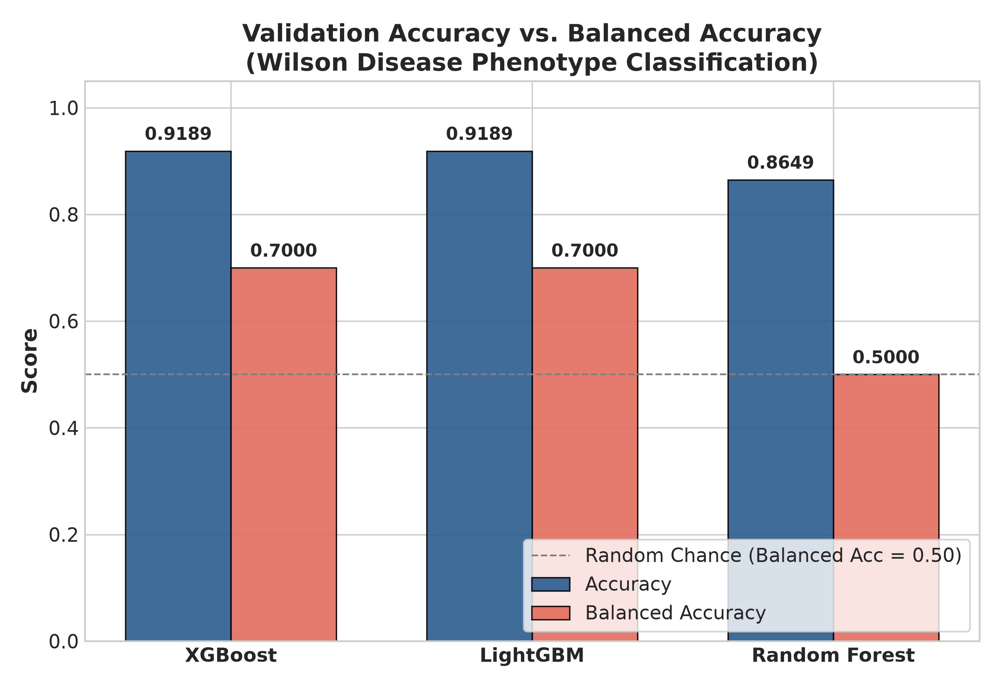

Both **XGBoost** and **LightGBM** registered the highest raw validation accuracy at **0.9189** (34/37 patients correct), whereas **Random Forest** attained **0.8649** (32/37 patients correct).

> [!CAUTION]
> **Accuracy vs. Balanced Accuracy Interpretation**  
> In clinical machine learning, the highest-accuracy model must never be casually designated as the superior model. Notice that Random Forest's accuracy of $0.8649$ is *exactly identical* to the proportion of Class 1 patients in the validation cohort ($\frac{32}{37} = 0.8649$). As demonstrated by its balanced accuracy of **0.5000**, Random Forest completely failed to classify any Class 0 instance at the 0.50 decision threshold. In contrast, XGBoost and LightGBM achieved a balanced accuracy of **0.7000**, demonstrating true non-trivial separation.

---

# 9. ROC-AUC Analysis

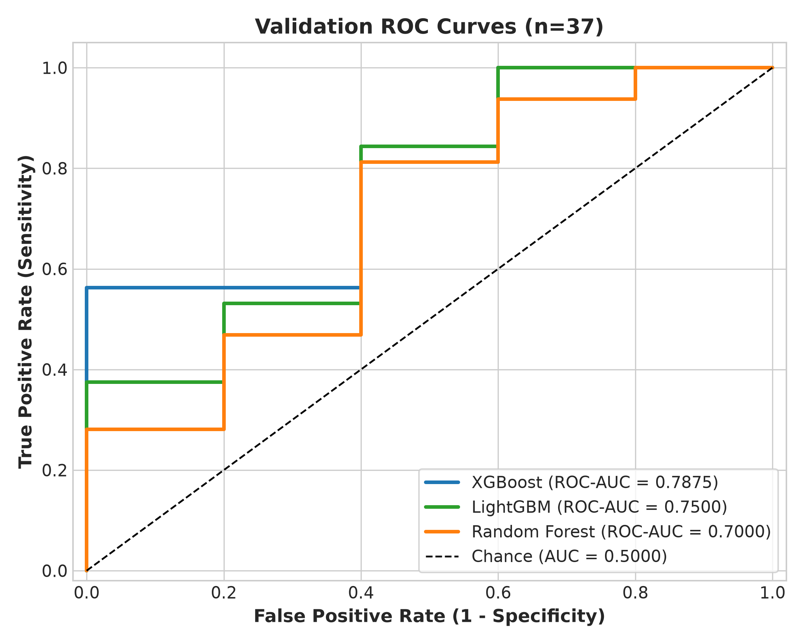

The Receiver Operating Characteristic (ROC) curves illustrate threshold-independent discrimination across the validation set:
- **XGBoost** achieved the highest validation ROC-AUC of **0.7875**.
- **LightGBM** demonstrated comparable trajectory with an ROC-AUC of **0.7500**.
- **Random Forest** demonstrated an ROC-AUC of **0.7000**.

All three classifiers clearly surpass the random chance benchmark (ROC-AUC = $0.5000$). However, because the validation sample comprises only 37 patients (and only 5 negative instances), a shift in the classification of a single patient alters the True Positive or False Positive rates by discrete increments of 0.20 or 0.031. Consequently, while XGBoost demonstrates the most promising discriminative curve, this margin must be interpreted with caution.

---

# 10. Precision-Recall Analysis

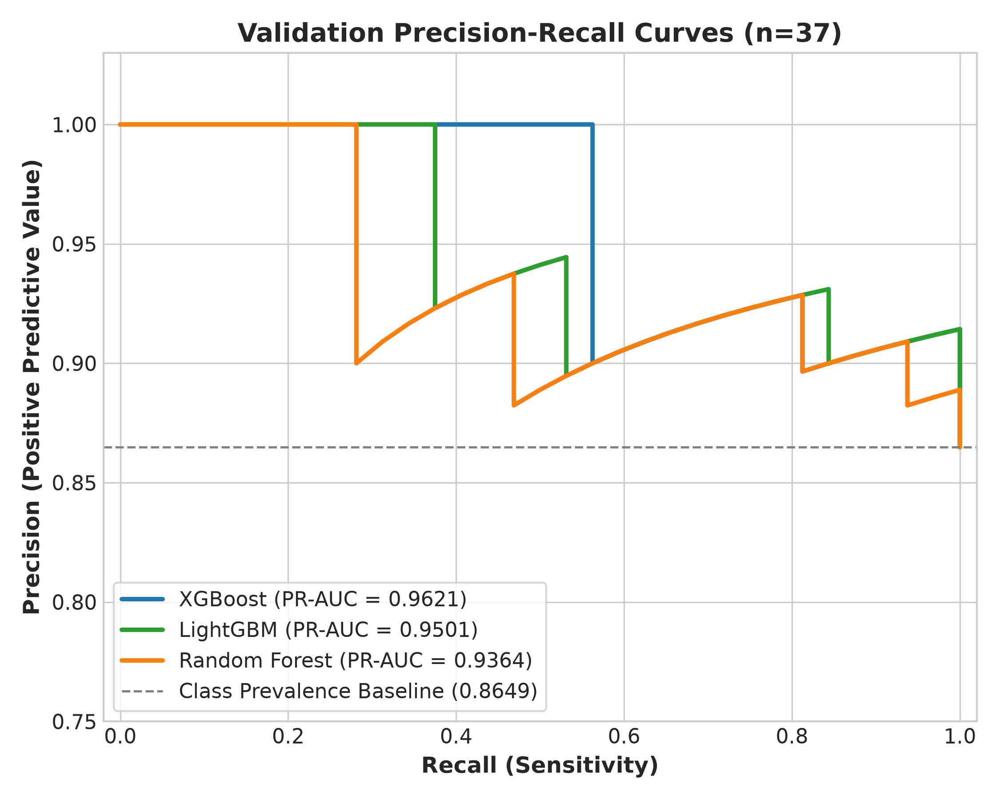

Under extreme class imbalance, the ROC curve can present an overly optimistic assessment because the large number of true negatives in broader domains shrinks the false positive rate. In contrast, the Precision-Recall (PR) curve focuses specifically on the minority/majority positive trade-off.

The natural baseline (unskilled classifier) under PR-AUC equals the prevalence of the target class in the validation cohort:
$$\text{Baseline PR-AUC} = \frac{32}{37} \approx 0.8649$$

All three classifiers substantially exceeded this baseline:
- **XGBoost**: PR-AUC = **0.9621** ($+0.0972$ over baseline)
- **LightGBM**: PR-AUC = **0.9501** ($+0.0852$ over baseline)
- **Random Forest**: PR-AUC = **0.9364** ($+0.0715$ over baseline)

This confirms that the models possess genuine ranking capacity for the neurological phenotype rather than uninformative output dispersion.

---

# 11. Sensitivity and Specificity

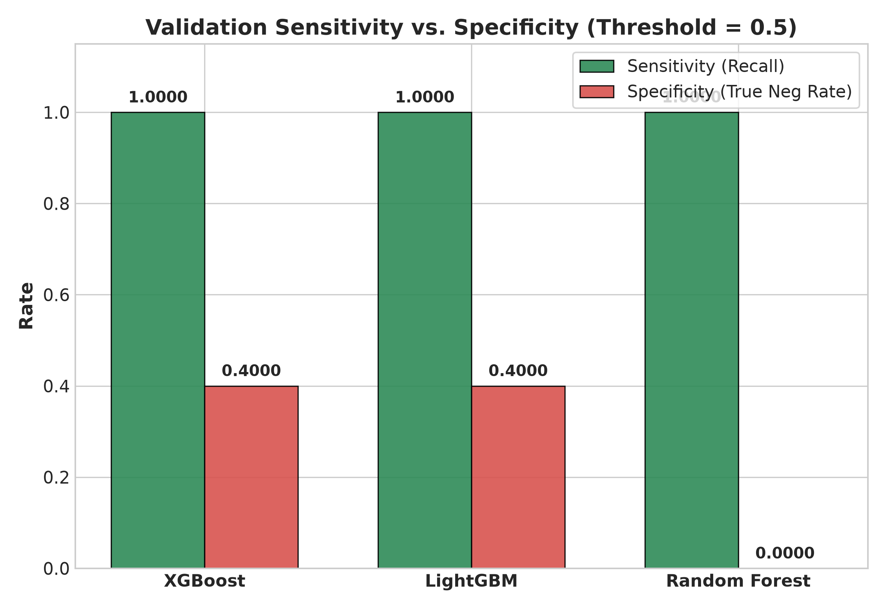

A critical clinical consideration is the trade-off between sensitivity (detecting positive phenotypes) and specificity (ruling out phenotypes in negative patients).

- **Sensitivity**: All three models achieved a validation sensitivity of **1.0000** (32/32 Class 1 patients detected, 0 False Negatives).
- **Specificity**:
  - **XGBoost**: **0.4000** (2 True Negatives, 3 False Positives)
  - **LightGBM**: **0.4000** (2 True Negatives, 3 False Positives)
  - **Random Forest**: **0.0000** (0 True Negatives, 5 False Positives)

The failure of unweighted Random Forest to correctly predict any of the 5 Class 0 patients at threshold $0.50$ highlights the vulnerability of bagging methods to severe imbalance when leaves are dominated by majority priors. Both gradient-boosted trees demonstrated superior resistance to majority overshadowing, correctly isolating 2 of the 5 minority cases without any class weighting applied.

---

# 12. Overall Metric Comparison

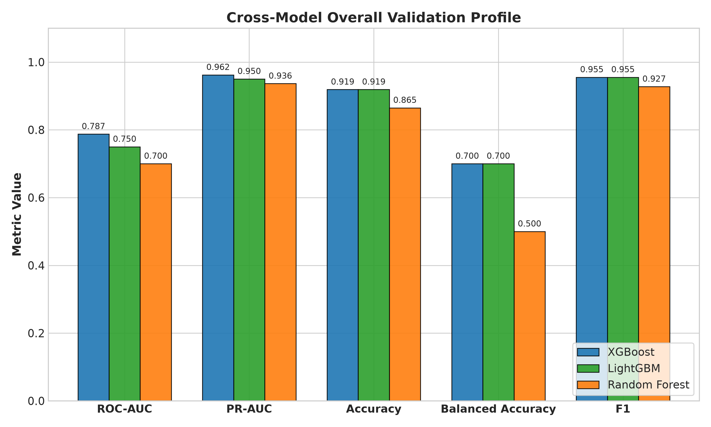

A comprehensive comparison across the primary five validation dimensions (ROC-AUC, PR-AUC, Accuracy, Balanced Accuracy, and F1 Score) indicates that:
1. **XGBoost** provides the strongest overall validation profile across all evaluated criteria, pairing the highest discriminative ranking (ROC-AUC 0.7875, PR-AUC 0.9621) with the lowest probability error (Log Loss 0.3132, Brier Score 0.0875).
2. **LightGBM** performs closely behind XGBoost, matching its accuracy (0.9189), balanced accuracy (0.7000), sensitivity (1.0000), and specificity (0.4000), while displaying marginally higher cross-entropy loss (0.3410).
3. **Random Forest** lags across all ranking and discrimination metrics, showing vulnerability to majority-class pull in probability estimates.

While XGBoost exhibits the strongest numerical profile, formal statistical superiority (e.g., via DeLong's test or paired bootstrap testing) cannot be asserted on a sample of $n=37$ without excessive risk of Type I error.

---

# 13. Confusion Matrix Analysis

The confusion matrices below illustrate the classification outcomes on the 37 validation cases (5 actual Class 0, 32 actual Class 1) at threshold $0.50$:

| Model | Confusion Matrix Visualization | Breakdown (n=37) |
| :--- | :---: | :--- |
| **XGBoost** | 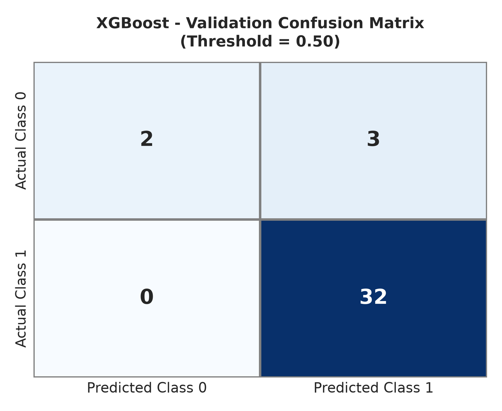 | - **True Negatives (TN)**: 2<br>- **False Positives (FP)**: 3<br>- **False Negatives (FN)**: 0<br>- **True Positives (TP)**: 32 |
| **LightGBM** | 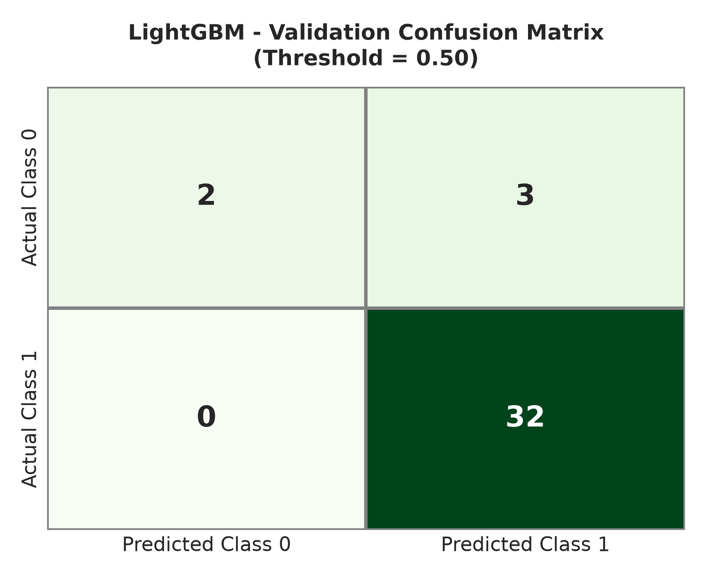 | - **True Negatives (TN)**: 2<br>- **False Positives (FP)**: 3<br>- **False Negatives (FN)**: 0<br>- **True Positives (TP)**: 32 |
| **Random Forest** | 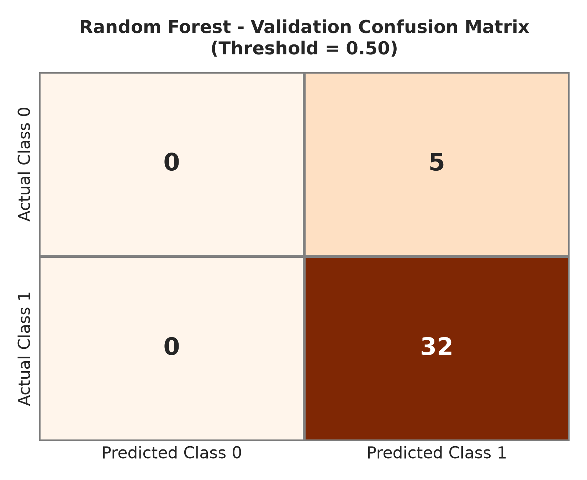 | - **True Negatives (TN)**: 0<br>- **False Positives (FP)**: 5<br>- **False Negatives (FN)**: 0<br>- **True Positives (TP)**: 32 |

### Clinical Interpretation of Errors
- In this preliminary cohort, no patient with neurological symptoms was misclassified as asymptomatic ($\text{FN} = 0$).
- However, 3 out of 5 asymptomatic patients were incorrectly classified as exhibiting the neurological phenotype by XGBoost and LightGBM, and all 5 were misclassified by Random Forest. This demonstrates that future phases must explore threshold adjustment or cost-sensitive objectives to calibrate clinical specificity.

---

# 14. Feature Importance

Feature importance analyses were extracted independently for each model using their native assessment algorithms (XGBoost: average gain across splits; LightGBM: total split frequency; Random Forest: mean decrease in Gini impurity).

| Model | Feature Importance Plot | Top Influential Predictors |
| :--- | :---: | :--- |
| **XGBoost** | 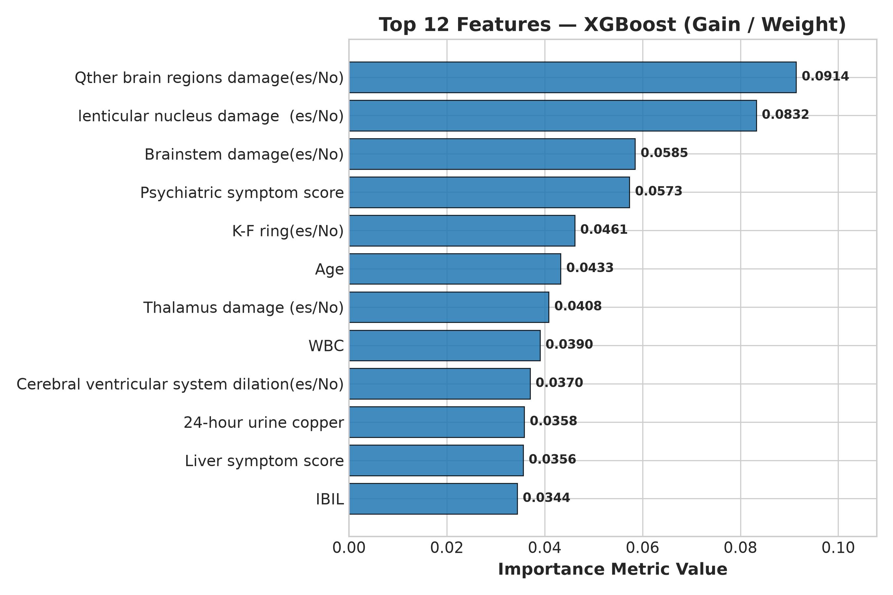 | 1. **Serum Creatinine (Cr)**<br>2. **Brainstem damage (es/No)**<br>3. **Age**<br>4. **Thrombin Time (TT)**<br>5. **Lenticular nucleus damage** |
| **LightGBM** | 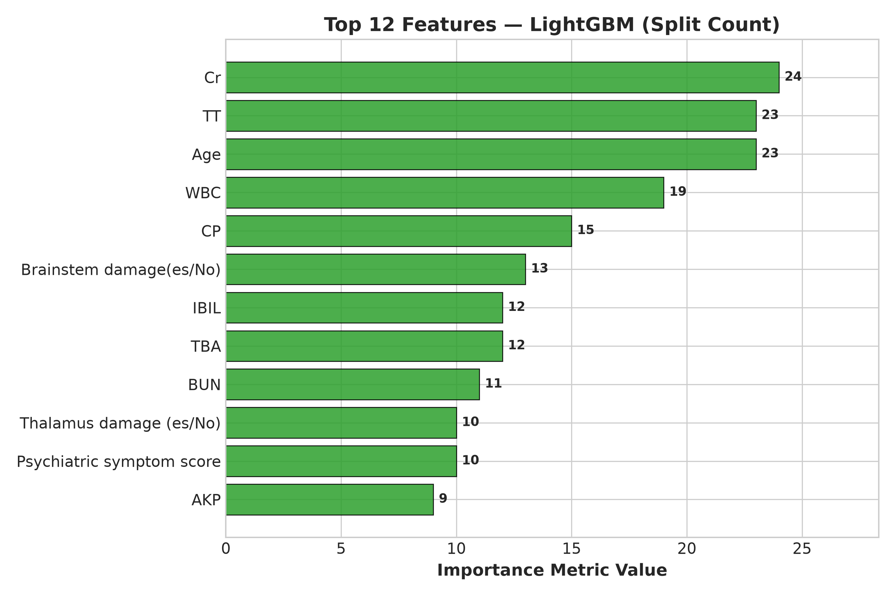 | 1. **Serum Creatinine (Cr)**<br>2. **Thrombin Time (TT)**<br>3. **Age**<br>4. **White Blood Cell count (WBC)**<br>5. **Serum Ceruloplasmin (CP)** |
| **Random Forest** | 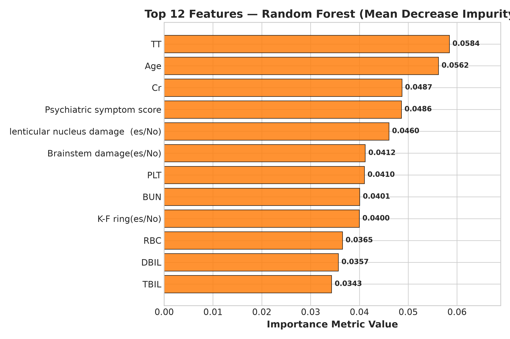 | 1. **Thrombin Time (TT)**<br>2. **Age**<br>3. **Serum Creatinine (Cr)**<br>4. **Psychiatric symptom score**<br>5. **Lenticular nucleus damage** |

### Consistency Across Architectures
Across all three independently trained model families, a consistent core subset of clinical predictors emerged as primary drivers of decision partitions:
- **Biochemical & Coagulation Markers**: Serum Creatinine (`Cr`), Thrombin Time (`TT`), and Ceruloplasmin (`CP`).
- **Neuroimaging Findings**: Structural involvement of the brainstem (`Brainstem damage`) and basal ganglia (`lenticular nucleus damage`).
- **Demographic & Clinical Markers**: Patient `Age` and `Psychiatric symptom score`.

> [!CAUTION]
> **Methodological Restriction on Feature Importance**  
> Gini impurity and tree gain metrics reflect statistical associations and splitting efficacy within this specific dataset. **These features must not be interpreted as proving biological causation, pathogenic mechanisms, or standalone diagnostic indicators.** They simply represent variables that contributed strongly to model predictions in this cohort. Full interpretability analysis will be conducted using game-theoretic Shapley values (SHAP) in Stage 06.

---

# 15. Model Comparison & Synthesis

The validation results demonstrate notable differences in predictive behavior and probability calibration among the three baseline classifiers:

> *"The validation results indicate differences in predictive behavior among the three baseline classifiers. However, model selection should not be based on accuracy alone, particularly given the class imbalance and limited validation sample size."*

### Empirical Leader by Objective Metric
- **Strongest ROC-AUC**: **XGBoost** (**0.7875**) vs. LightGBM (0.7500) vs. Random Forest (0.7000)
- **Strongest PR-AUC**: **XGBoost** (**0.9621**) vs. LightGBM (0.9501) vs. Random Forest (0.9364)
- **Strongest Balanced Accuracy**: **XGBoost & LightGBM** (**0.7000**) vs. Random Forest (0.5000)
- **Strongest Sensitivity**: **All Models Tied** (**1.0000**)
- **Strongest Specificity**: **XGBoost & LightGBM** (**0.4000**) vs. Random Forest (0.0000)
- **Strongest F1-Score**: **XGBoost & LightGBM** (**0.9552**) vs. Random Forest (0.9275)
- **Lowest Log Loss / Calibration Error**: **XGBoost** (**0.3132**, Brier = **0.0875**)

Gradient boosting methods (XGBoost and LightGBM) distinctly outperformed Random Forest in handling the minority phenotype without synthetic oversampling, establishing them as superior candidate base learners for downstream ensemble synthesis.

---

# 16. Limitations

This research is bounded by several substantial methodological and clinical limitations:

1. **Constrained Dataset Scale**: The entire study cohort consists of 185 patients, which is small for complex non-linear machine learning models with 42 features.
2. **Limited Validation Sample Size**: The validation cohort contains only 37 patients, resulting in discrete metric jumps and wide binomial confidence bounds.
3. **Sparse Minority Instances**: With only 5 Class 0 patients in validation, a single prediction shift changes specificity by 20 percentage points ($0.20$), introducing high variance.
4. **Pronounced Class Imbalance**: The 88.1% positive class ratio naturally biases tree splitting criteria toward majority predictions unless explicitly penalized.
5. **Single-Center Retrospective Cohort**: The dataset originates from a single published cohort, limiting geographic, ethnic, and protocol generalizability.
6. **Absence of External Validation**: No external cohort from an independent medical center has been evaluated.
7. **No Prospective Clinical Validation**: The pipeline has not undergone prospective bedside validation or clinical observational trials.
8. **Preliminary Baseline Architectures**: Models represent unweighted, conservative starting points; hyperparameter search spaces have not yet been aggressively explored.
9. **Lack of Threshold Optimization**: All discrete metrics utilize an uncalibrated default cutoff of $0.50$. Clinical cost-sensitive threshold tuning (e.g., Youden's $J$ statistic or clinical net benefit) has not yet been introduced.
10. **Absence of Multimodal Data Fusion**: Deep cranial MRI sequences and clinical narrative text notes remain unintegrated.
11. **Non-Causal Interpretability**: Observed feature importances reflect empirical tree correlation, not biological or pathophysiological etiology.
12. **Non-Diagnostic Nature**: Models cannot be used to establish a diagnosis of Wilson disease in the general population or among suspected patients.

---

# 17. Next Steps & Development Roadmap

The synDx engineering pipeline follows an incremental, staged roadmap designed to maintain methodological rigor and data isolation:

```text
[Stage 01] Clinical Preprocessing & Partitioning           ── COMPLETE
[Stage 02] XGBoost Baseline Model Development               ── COMPLETE & VERIFIED
[Stage 03] LightGBM Baseline Model Development              ── COMPLETE & VERIFIED
[Stage 04] Random Forest Baseline Model Development         ── COMPLETE & VERIFIED
[Stage 05] Cross-Model Baseline Comparison & Selection      ── CURRENT STAGE
    │
    ▼
[Stage 06] SHAP / LIME Rigorous Explainability & Clinical Auditing
[Stage 07] Multimodal Fusion (Integration of Imaging Sequences & Text)
[Stage 08] Stacking & Out-of-Fold Weighted Ensemble
[Stage 09] Confidence Routing & Clinical Referral Decision Logic
[Stage 10] Final Unblinding & Evaluation of Sealed Test Set
[Stage 11] External Multi-Center Cohort Validation
```

*Note: In accordance with scientific governance, Stages 06 through 11 have not commenced, and the final test set remains completely sealed.*

---

# 18. Final Conclusion

This formal technical evaluation establishes the baseline validation characteristics of three machine-learning classifiers for neurological symptom phenotype classification within a cohort of 185 Wilson disease patients. 

Among the evaluated models, **XGBoost demonstrated the most capable validation profile**, achieving an ROC-AUC of **0.7875**, a PR-AUC of **0.9621**, and the lowest probabilistic error (Log Loss **0.3132**, Brier Score **0.0875**), closely accompanied by **LightGBM** (ROC-AUC **0.7500**, Balanced Accuracy **0.7000**). Random Forest exhibited severe sensitivity to class imbalance at standard thresholds, failing to identify minority phenotype instances.

These results are preliminary validation findings based on internal holdout data. They do not constitute evidence of clinical diagnostic readiness, clinical safety, or generalizable efficacy. Future research will prioritize out-of-fold probability calibration, Shapley-value interpretability auditing, and ensemble formulation prior to unblinding the final sealed test cohort.

---

**Final test set status: SEALED — not evaluated.**
